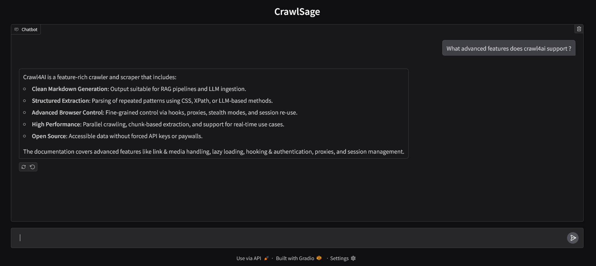

# CrawlSage

CrawlSage is an intelligent Retrieval-Augmented Generation (RAG) agent designed to assist developers and users in navigating and understanding Crawl4AI, blazing-fast, AI-ready web crawling tailored for LLMs, AI agents, and data pipelines. All written in python

## Tech Stack

- **Crawl4AI** : For crawling the docs
- **PydanticAI**: Agent framework
- **Gradio**: UI
- **SQLAlchemy**: ORM
- **Supabase**: Cloud based Postgres database with vector storage
- Uses **Gemini 2.0 flash** as the agent model and Gemini **text-embedding-004** for embedding generation.

  These are the defualt settings and are changeable.

  Gemini models are used as they offer substansial free tier API usage, but they can be easily replaced to any other model including openai, openai compatiable models, locally hosted models etc.

  Any vector supporting database can be used. Supabase does offer free usage.

## Run Locally

**Prerequisites:** Have python 3.x installed

1. Clone the project

   ```bash
   git clone https://github.com/Dilpreet-singh-13/CrawlSage.git
   cd CrawlSage
   ```

2. Set Up a Virtual Environment

   ```bash
   python -m venv venv
   venv\Scripts\activate  # On Unix or MacOS use `source venv/bin/activate`
   ```

3. Install dependencies

   ```bash
   pip install -r requirements.txt
   ```

4. Setup environment variables

   The project includes a `.env.example` file. It serves as a template, listing all required environment variables with placeholder values.

   Duplicate the `.env.example` file and rename it to `.env`.

   Add the database credentials, Gemini API key and model names.

   ```bash
    cp .env.example .env
   ```

5. Setup database

   Run `db_setup.py` to make the necessary tables in the database and add the necessary extensions for vector storage.

   ```bash
   python db_setup.py
   ```

6. Setup Crawl4AI

   ```bash
   # Run post-installation setup for crawl4ai
   crawl4ai-setup
   ```

7. Populate the database

   Run the crawler that crawls the [Crawl4AI docs](https://docs.crawl4ai.com/), process and store them.

   ```bash
   python crawler.py
   ```

8. Launch the UI

   ```bash
   python app.py
   ```

This runs the app on `http://127.0.0.1:7860/`

## Screenshots


